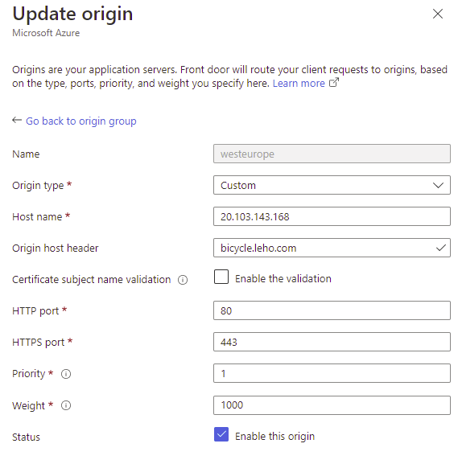

# Multi-Region Setup.

The business unit has deployed their application in two different application stamps in different regions. To improve availability of their solution for their end customers and protect from regional data center outages, they want both stamps to back up each other.

After further consultation with their architecture team, they decide to test Azure Front Door offering further benefits.
- Traffic Optimization 
- SSL Offloading
- Automatic Failover

## Prerequesites
- Make sure you have two independent deployments of the AKS baseline architecture reference implementation deployed and available.
- These need to be deployed to *different regions*.
- When connecting to backend system, Front Door requires certificates issued by a well-known certificate authority. For the purpose of this walkthrough, only self-signed certificates have been created instead. This is why we will use the unencrypted http protocol (instead of https) to connect to the Application Gateways. *Do not use this setup* in a production environment, as it exposes unprotected public endpoints.
  - Add a listener for port 80 in your Application Gateway configuration.
  - Remember to add a Firewall rule in the VNet hosting your Application Gateway.


##  Walthrough Overview
In this overview, you will
- Create an Azure Front Door instance.
- Add your application stamps as _origins_ to your Front Door instance.
- See how Front Door directs http(s) requests to the closest endpoint.
- See how Front Door will handle a failover in case one origin becomes unavailable.
- Restrict access to your origins, only allowing incoming traffic from Azure Front Door.
- See that this does not prevent other Front Door instances to access your Application Gateway.
- Learn how to restrict access from only your Front Door.

## Procedure

### Create your Azure Front Door instance and add the first origin as backend.

1. Create a new Resource Group with name `[your prefix]-rg-bu0001a0008-multiregion`

   

1. Create a new Azure Front Door instance (search for _Front Door and CDN profiles_); select _Azure Front Door_ and _Custom Create_.

   

   

   Do not configure any secrets, but define an endpoint named `[your prefix]-rg-bu0001a0008` 

   

   Add an endpoint configuration to your Front Door:

   

   Add a route:

   (Make sure to only _accept_ HTTPS, but use HTTP for _forwarding_.)

   
   
   Create a new origin group:

   

   And, to this origin group, add a new origin pointing to your Application Gateway as Backend. Please make sure to...
   - ...use the IP as _Host name_,
   - ...use the domain name `bicycle.[your domain]` as _Origin host header_.
   - ...disable _Certificate subject name validation_.

   

   Skip the Security Policy for now.

   If the validation passed, Hit _Create_ and wait for your Front Door to get deployed.

   

   

1. Get the FQDN of your Front Door...
 
   

   ...and open `http://<your endpoint fqdn>`:

   


### Add a second origin as backend.

1. Now add a second origin and use the setup that one of your colleagues deployed.

   

1. Deploy a Test-VM in the region of that second origin. 

   

1. Connect to that VM, oben the browser and navigate to the Front Door endpoint. Compare the value of _Host Name_ with the value when accessing via your own browser.

   (In the setup used for this tutoruial), these were the container names running in Central US: 
   ```bash
   $ kubectl get pods -n a0008 --context shco-aks-pbl5hvxsyw5yy  | grep aspnet
   aspnetapp-deployment-56b77c4f79-cl8k2       1/1     Running   0          38h
   aspnetapp-deployment-56b77c4f79-cv4hp       1/1     Running   0          38h
   ```
   
   ...and these were running in West Europe:
   ```bash
   $ kubectl get pods -n a0008 --context leho-aks-rio6zecikhluy  | grep aspnet
   aspnetapp-deployment-56b77c4f79-f5bvk       1/1     Running   0          17h
   aspnetapp-deployment-56b77c4f79-l2rpb       1/1     Running   0          17h
   ```

   Azure VM running in Central US:
   
   
   Author's development VM:
   
   


1. You have seen how Front Door directs user requests to the region closest to the user location.


### Simulate a failover 

1. Stop the Application Gateway in one of your regions.

   ```bash
   az network application-gateway stop --id /subscriptions/[subscription id]/resourceGroups/[resource group name]/providers/Microsoft.Network/applicationGateways/[application gateway name]
   ```

1. Go to the _Metrics_ blade of your Front Door and select _Origin Health Percentage_. The number should have decreased.

   

1. Refersh the page on the machine running in the region in which you shut down the Application Gateway. It now returns responses from the other region.
   
   

   
1. Start the Application Gateway.

   ```bash
   az network application-gateway start --id /subscriptions/[subscription id]/resourceGroups/[resource group name]/providers/Microsoft.Network/applicationGateways/[application gateway name]
   ```

1. Refresh the page again and see how Front Door now dispatches requests to the nearest region again.
   

## Only allow Front Door(s) to access your backends

1. Note that so far, the public endpoint of your Applcation Gateway is still open to serve any direct request (i.e., not passing Front Door). 

   

1. To restrict access from Front Door only, go back to the Network Security Groups applied to the subnet hosting your Application Gateway. Change the inbound rule for port 80 to only allow requests originating from Service Tag _AzureFrontDoor.Backend_.
   
   

   (Of course, as long port 443 remains open on the Network Security Group, the service remains directly accessible via the Application Gateway. This is for demo purposes only.)

1. Direct requests to the Application Gateway from  your browser will now time out, while the service remains accessible via Front Door:

    

1. Get access to a second Front Door (either by deploying another instance of joining forces with another workshop participant.)

1. Ensure both Front Door instances have the same origins set up. And verify, both Front Door instances can well reach all origins. This shows, that the rules in the Network Security Group allow incoming requests from arbitrary Front Door instances to reach the Application Gateway.

   

## Ensure only _your_ Front Door can access your Application Gateway using WAF.

1. Take a look at [How do I lock down the access to my backend to only Azure Front Door?
](https://docs.microsoft.com/en-us/azure/frontdoor/front-door-faq#how-do-i-lock-down-the-access-to-my-backend-to-only-azure-front-door-); the last paragraph of this section shows how to use the http header `X-Azure-FDID` to apply a Web Application Firewall (WAF) rule to only accept requests originating from specific Front Doors on the Application Gateway level. 

1. To define custom rules, we need to slightly change our WAF setup. Application Gateway two ways of defining WAF rules: 
   - The _legacy_ way is configuring a WAF configuration within the Application Gateway. This is the configuration you find in your setup after deployment. This configuration does not allow to define custom rules but only pre-defined rule collections, e.g., OWASP rule sets.

   

   - Deploying a _Web Application Firewall Policy_ is the newer way. It allows to define the policy as dedicated Azure resource which can be reused by different Application Gateways. This configuration allows to define custom rules, e.g., based on http headers.

1. As our setup uses the legacy way, we will need to migrate the WAF configuration to a WAF policy. There is a [PowerShell script](https://docs.microsoft.com/en-us/azure/web-application-firewall/ag/migrate-policy) available that you find in `res\migrate-policy.ps1`. Please use it to crate a WAF policy from your current Application Gateway configuration and update your gateway:

   DOES NOT WORK!!!

   ```PowerShell
   .\migrate-policy.ps1 `
   >> -subscriptionId "12345678-abcd-efgh-ijkl-987654321abc" `
   >> -resourceGroupName "shco-rg-bu0001a0008" `
   >> -applicationGatewayName "shco-apw-pbl5hvxsyw5yy" `
   >> -wafPolicyName "shco-wafp-pbl5hvxsyw5yy"
   Set-AzApplicationGateway : Either Data or KeyVaultSecretId must be specified for Certificate '/subscriptions/12345678-abcd-efgh-ijkl-987654321abc/resourceGroups/shco-rg-b
   u0001a0008/providers/Microsoft.Network/applicationGateways/shco-apw-pbl5hvxsyw5yy/trustedRootCertificates/root-cert-wildcard-aks-ingress' in Application Gateway.
   At C:\_BUFFER\CPQ\migrate-policy.ps1:170 char:14
   +     $appgw = Set-AzApplicationGateway -ApplicationGateway $appgw
   +              ~~~~~~~~~~~~~~~~~~~~~~~~~~~~~~~~~~~~~~~~~~~~~~~~~~~
      + CategoryInfo          : CloseError: (:) [Set-AzApplicationGateway], CloudException
      + FullyQualifiedErrorId : Microsoft.Azure.Commands.Network.SetAzureApplicationGatewayCommand

   firewallPolicy: shco-wafp-pbl5hvxsyw5yy has been created/updated successfully and applied to applicationGateway: shco-apw-pbl5hvxsyw5yy!

   Name                                     Account                          SubscriptionName                 Environment                     TenantId
   ----                                     -------                          ----------------                 -----------                     --------
   bastianulke -- External (ce9d064e-10a... lh@m365x54640868.onmicrosoft.com bastianulke -- External          AzureCloud                      679a5224-7633-461d-adce-df49...

   CustomRules       : {}
   PolicySettings    : Microsoft.Azure.Commands.Network.Models.PSApplicationGatewayFirewallPolicySettings
   ManagedRules      : Microsoft.Azure.Commands.Network.Models.PSApplicationGatewayFirewallPolicyManagedRules
   ResourceGroupName : shco-rg-bu0001a0008
   Location          : centralus
   ResourceGuid      :
   Type              : Microsoft.Network/ApplicationGatewayWebApplicationFirewallPolicies
   Tag               :
   TagsTable         :
   Name              : shco-wafp-pbl5hvxsyw5yy
   Etag              : W/"9ba32115-d9d3-4895-8975-8955a4f967f2"
   Id                : /subscriptions/12345678-abcd-efgh-ijkl-987654321abc/resourceGroups/shco-rg-bu0001a0008/providers/Microsoft.Network/ApplicationGatewayWebApplicationFir
                     ewallPolicies/shco-wafp-pbl5hvxsyw5yy
   ```

   ...but certificate definition details missing in PowerShell object:
   ```
   $appgw=Get-AzApplicationGateway -Name "shco-apw-pbl5hvxsyw5yy" -ResourceGroupName "shco-rg-bu0001a0008"
   $appgw

   ...
   TrustedRootCertificates             : {root-cert-wildcard-aks-ingress}
   BackendHttpSettingsCollectionText   : [
                                        {
                                          ...
                                          "TrustedRootCertificates": [
                                            {
                                              "Id": "/subscriptions/12345678-abcd-efgh-ijkl-987654321abc/resourceGroups/shco-rg-bu0001a0008/providers/Microsoft.Network/applicationGateways/shco-apw-pbl5hvxsyw5yy/trustedRootCertificates/root-cert-wildcard-aks-ingress"
                                            }
   ```
   
1. To only allow _your specific_ Front Door to access the Application Gateway, get the _Front Door ID_ from the resource overview. 
   


1. ...to be continued.


# Resources
- [End-to-end TLS with Azure Front Door](https://docs.microsoft.com/en-us/azure/frontdoor/end-to-end-tls#backend-tls-connection-azure-front-door-to-backend):

  "For HTTPS connections, Azure Front Door expects that your backend presents a certificate from a valid Certificate Authority (CA) with subject name(s) matching the backend hostname."

- [Migrate Web Application Firewall policies using Azure PowerShell](https://docs.microsoft.com/en-us/azure/web-application-firewall/ag/migrate-policy)
   
   (for `res/migrate-policy.ps1`)