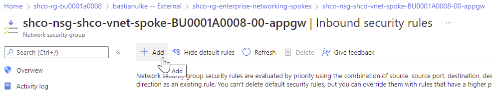
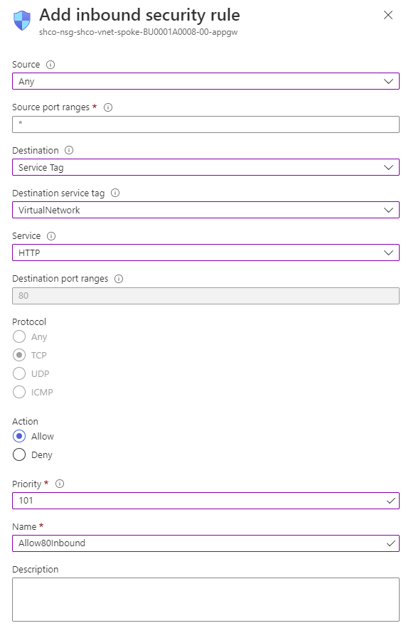
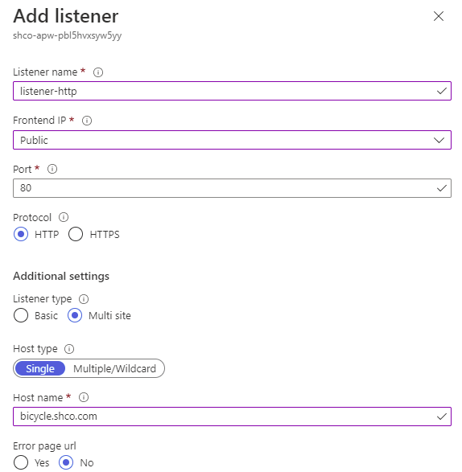
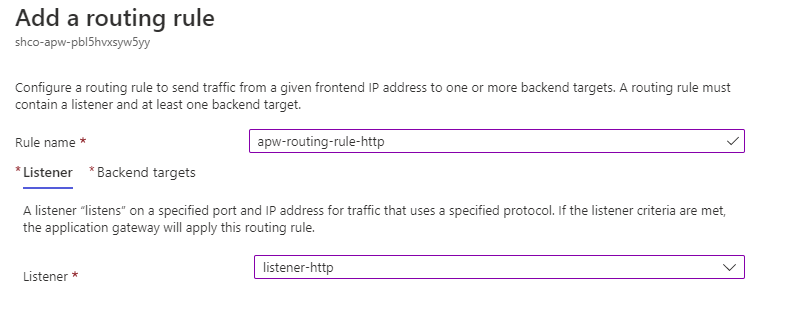
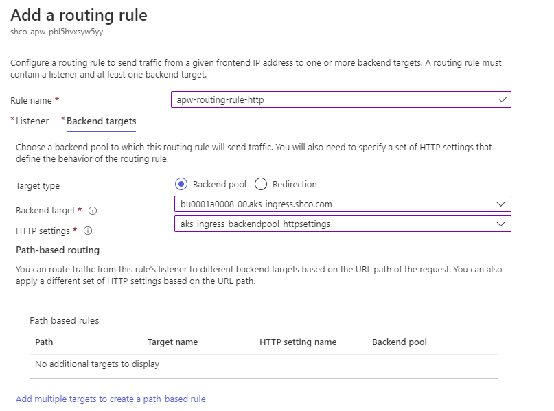

1. Browse to NSG hosting the Application Gateway.
   

1. Configure a new inbound traffic rule.

   

1. Browse to your Application Gateway.

1. Add a new Listener for port 80.

   

1. Add a new Request Routing Rule

   

   
   
   