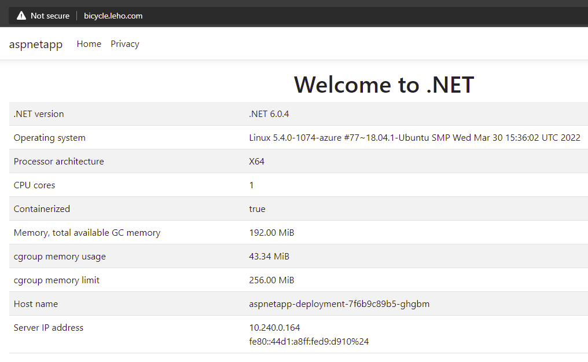

# Add NSG rule to allow incoming traffic on port 80.

1. Browse to NSG attached to the subnet hosting the Application Gateway.
   

1. Configure a new inbound traffic rule.

   

#  Add Application Gateway Listener for port 80.

1. Browse to your Application Gateway.

1. Add a new Listener for port 80. 

   

1. Add a new Request Routing Rule

   

   
   
1. Open `http://bicycle.leho.com/` to verify the Application Gateway well serves responses on http/80.

   