# Clone Repository and Build Image

1. Clone repo [cs_cross-platform-api](https://github.com/ulkeba/cs_cross-platform-api) to your development machine.
   This application provides a very simple API to generate some load on your worker nodes.

1. (optional) If you want to test it, run `dotnet run`...
   ```bash
   $ dotnet run

   Welcome to .NET 6.0!
   ---------------------
   SDK Version: 6.0.202
   
   ...

   Building...
   info: Microsoft.Hosting.Lifetime[14]
       Now listening on: https://localhost:7230
   ```

   and browse to endpoint `https://localhost:7230/RandomMultiplications`:

   ```bash
   $ curl -k https://localhost:7230/RandomMultiplications
   {"numbersGenerated":104857600,"timeUsed":864.8026}
   ```
1. For simplicity, temporarily open your container registry for for client IP:
   
   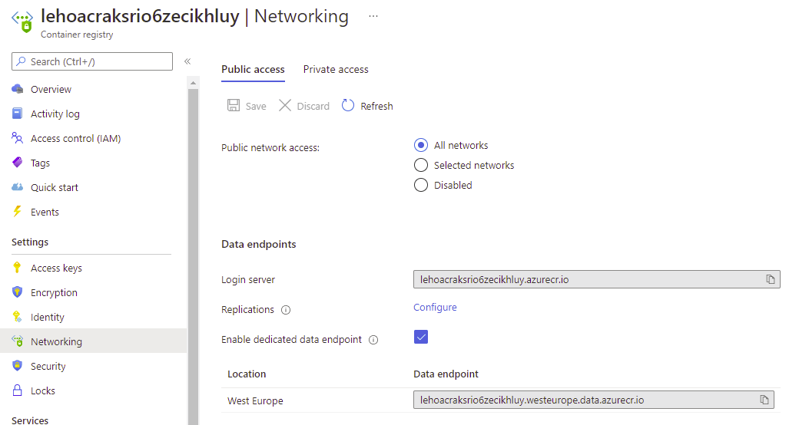

1. Build this application as container in your Azure Container Registry:
   ```bash
   az acr build --image randommultiplications-linux:latest --registry "lehoacraksrio6zecikhluy" --file Dockerfile-linux .
   ...
   Run ID: cb7 was successful after 49s
   ```

1. Browse to the repositories and see that the image you just built:

   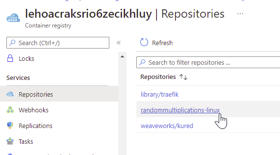

1. Edit the file `res/randommultiplications.yaml` and 
   - replace `<your acr name>` point to your ACR.
   - replace `<your domain>` with your domain.

1. Apply the descriptor ...

   ```bash
   kubectl apply -f ./randommultiplications.yaml
   ```

   ...and check the deployment can be created successfully:

   ```bash
   kubectl get deployments -n a0008
   NAME                         READY   UP-TO-DATE   AVAILABLE   AGE
   mult-deployment              2/2     2            2           2h
   ```

1. Open `https://bicycle.<your domain>/RandomMultiplications` and check the API returns a response:

   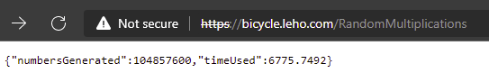

   ...or:

   ```bash
   curl -k https://bicycle.leho.com/RandomMultiplications
   {"numbersGenerated":104857600,"timeUsed":6757.4791}
   ```

   (It takes some seconds to generate some millions of random numbers, simply putting some pressure on the CPU).


#  Run your first Load Test with Azure Load Testing

1. (Prerequisite) We are creating some load on the backend that might cause slow responses. To avoid Application Gateway to close connections early, increase the timeout from 60 to 300 seconds:
   
   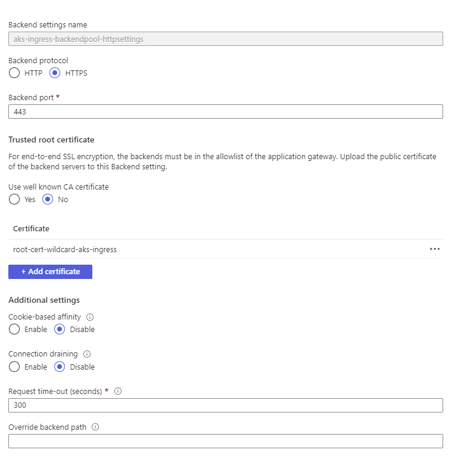


1. (For your information only) We will use Azure Load Testing in the following steps. This takes a Apache JMeter test plan as input to simulate load on workloads running on the Azure platform. You can use the JMeter GUI (see sceenshot) to define a testplan; in this tutorial, we will use a predefined test plan.

   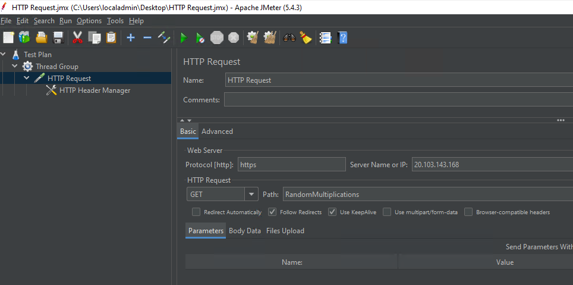

1. In the Azure portal, create a new Azure Load Testing in (Please note that this resoruce is currently in Public Preview!).
   Please create the instance in region _East US 2_ (no matter where the other resources are deployed).
   (Note that Load Testing currently is only available in a limited set of regions.)

   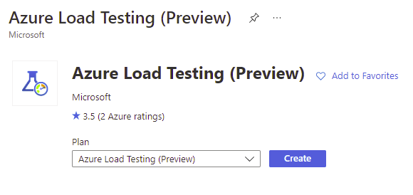

   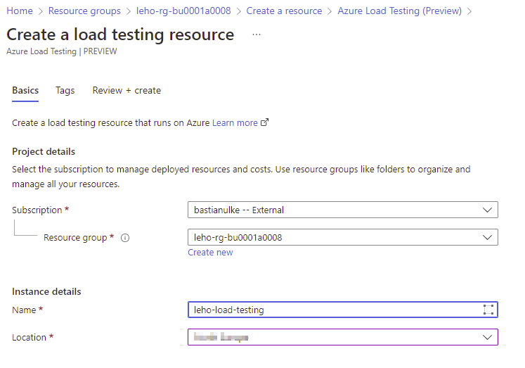

1. Create a new test and name it "25 threads, 10 loops"
   
   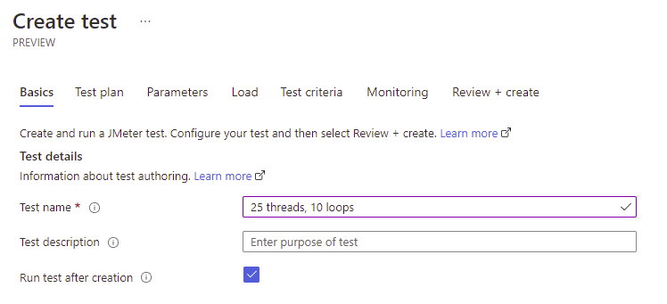

1. Upload `load-test.jmx` from the `res` directory.

   

1. Define the parameters `appGatewayEndpoint` (IP of your application gateway), `hostHeader`, `threads` (defining how many requests will be run in parallel) and `loops` (how man repetitions will be done):

   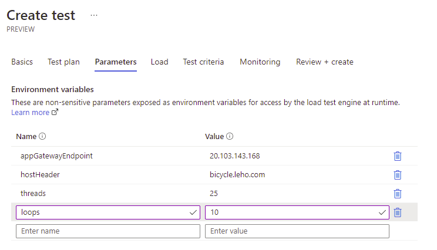

1. Accept the for _Load_ and _Test criteria_ and add your AKS resource and the `npuser` Virtual Machine Scale Set as monitored resources (double-check you select the right ones ;-)).

   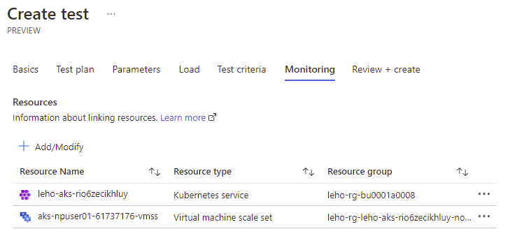

1. Wait for the test to complete. You might want to inspect _Insights_ of your AKS cluster while the test is running:

   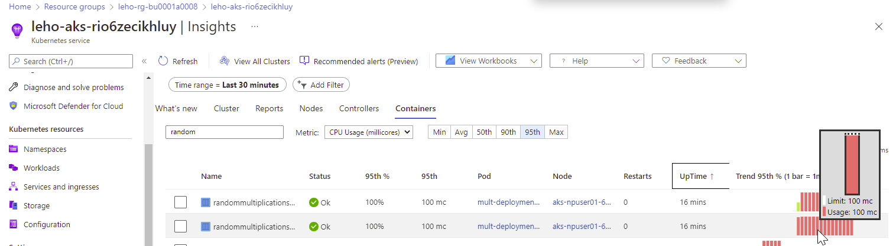

1. Inspect the results of your test. Response times are pretty high...

   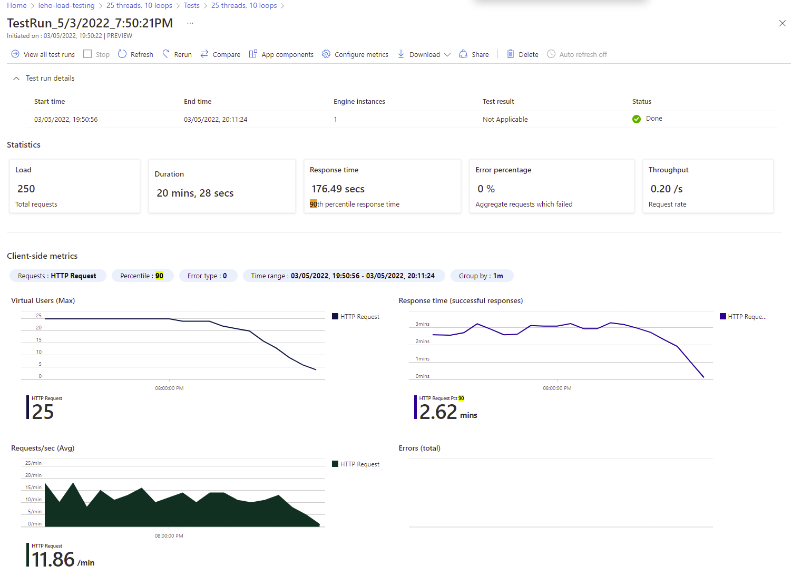

# Run your second Test

1. Deploy the `Horizontal Pod Autoscaler` defined in `randommultiplications-hpa.yaml`.

   ```bash
   kubectl apply -f randommultiplications-hpa.yaml
   ```

1. Start watching the set of pods deployed to your cluster using `watch`:

   ```batch
   watch kubectl get pods -n a0008
   ```

   Example output:
   ```bash
   Every 2.0s: kubectl get pods -n a0008         LAPTOP-QP3491VL: Wed May  4 10:00:11 2022

   NAME                                        READY   STATUS    RESTARTS      AGE
   mult-deployment-7766b6c6b8-bdrwk            1/1     Running   0             14h
   mult-deployment-7766b6c6b8-tfgkm            1/1     Running   0             14h
   ...
   ```

1. Re-run the existing Azure Load Test again and observe how kubernetes deploys further (up to 10) pods to serve incoming requests.

   Example output:
   ```bash
   Every 2.0s: kubectl get pods -n a0008         LAPTOP-QP3491VL: Wed May  4 10:07:09 2022

   NAME                                        READY   STATUS    RESTARTS      AGE
   mult-deployment-7766b6c6b8-2tpxg            1/1     Running   0             2m13s
   mult-deployment-7766b6c6b8-452v4            1/1     Running   0             3m13s
   mult-deployment-7766b6c6b8-45fx8            1/1     Running   0             2m13s
   mult-deployment-7766b6c6b8-8k2kt            1/1     Running   0             2m13s
   mult-deployment-7766b6c6b8-bdrwk            1/1     Running   0             14h
   mult-deployment-7766b6c6b8-ddpk6            1/1     Running   0             4m14s
   mult-deployment-7766b6c6b8-fzcj9            1/1     Running   0             3m59s
   mult-deployment-7766b6c6b8-gjqgx            1/1     Running   0             2m13s
   mult-deployment-7766b6c6b8-p8vnz            1/1     Running   0             4m14s
   mult-deployment-7766b6c6b8-tfgkm            1/1     Running   0             14h
   ...
   ```

   You can also observe _Insights_ of your AKS cluster again to see how new pods immediatly experience high load after creation:

   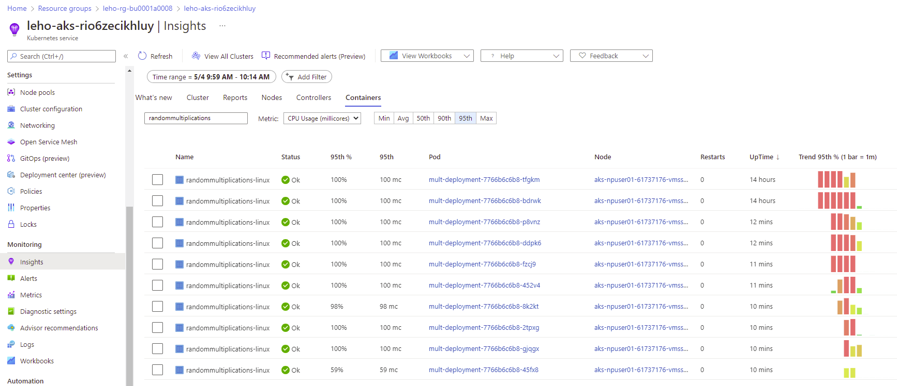

1. Inspect the results of the test again. You can see that (a) response times reduced towards the end of the test and much more requests could be processed per minute.

   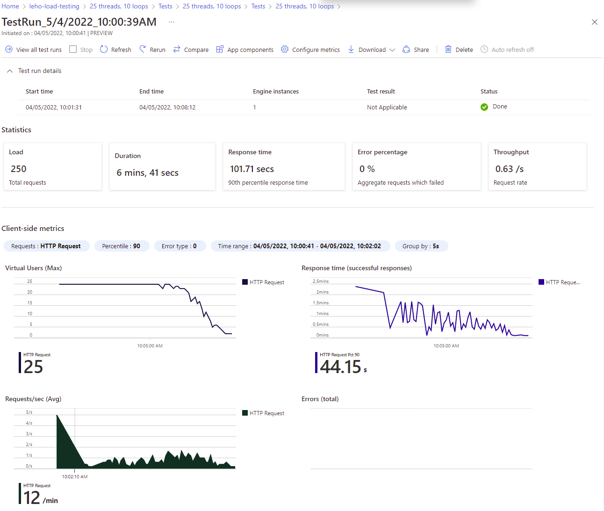

# Increase Pressure.

1. Increase `maxReplicas` in `randommultiplications-hpa.yaml` to 100 and redeploy the pod autoscaler.

1. Create another test in Azure Load Testing with 50 threads and 100 loops and run it.

   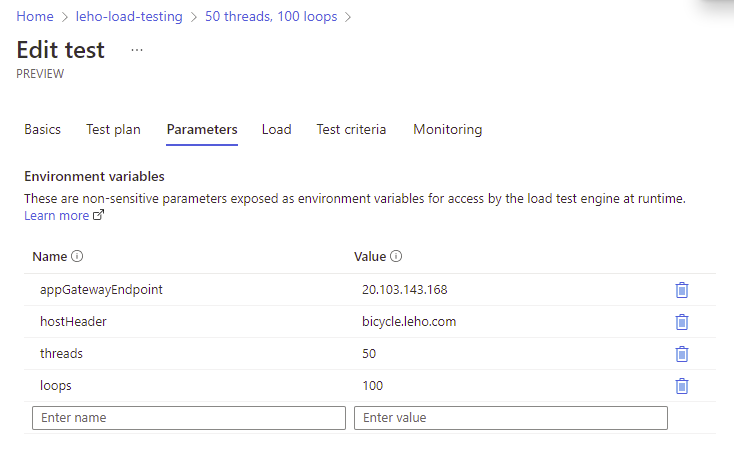

1. You will see the number of pods increasing again.

1. Also start watching the set of worker nodes using `watch`:

   ```batch
   watch kubectl get nodes
   ```

   After some time, you will not only see the number of pods increasing, but also the number od nodes.

1. Observing the _Nodes_ tab of your AKS _Insights_, you see the load on your worker nodes and how more workers are added to the cluster:

   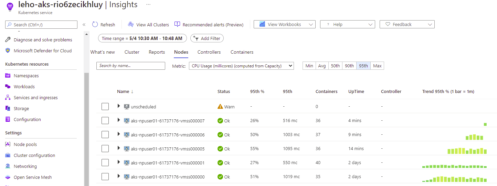

1. Note that there are some pods remaining in the _Unscheduled_ section. They remain unscheduled as the maximum number of nodes for the agent pool (which is 5) has been reached.  You can verify this in the AKS logs:
   ```
   AzureDiagnostics
   | where Category == "cluster-autoscaler"
   | project TimeGenerated, attrs_s, log_s, pod_s
   | sort by TimeGenerated desc
   ```

   ...there will be messages like:
   ```
   I0504 08:51:27.738811 1 scale_up.go:461] No expansion options
   I0504 08:51:17.536867 1 klogx.go:86] Pod a0008/mult-deployment-7766b6c6b8-8rzzz is unschedulable
   ```

1. But why is that? Looking at the _Nodes_ tab of AKS _Insights_, neither memory or CPU capacity is exhausted. Go to the metrics and select `insights.containers/pods` namespace, `podCount` as metric and apply a splitting by `Node`. You see that the number of pods scheduled on a node does not exceed a value of 26 (the cluster definition defines a `maxPods` to be 30 for each node; we are still investigating why it does not reach 30).

   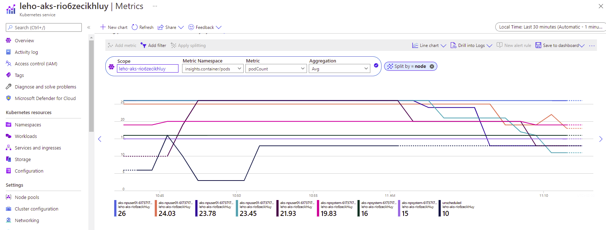


1. Once the test terminated, inspect the results of the test again. Also see how the peak of requests per second correlates with the peak of deployed pods.

   

1. After some time, the number of pods and nodes will decrease again. The AKS logs reveal some further information:
   ```
   AzureDiagnostics
   | where Category == "cluster-autoscaler"
   | project TimeGenerated, attrs_s, log_s, pod_s
   | sort by TimeGenerated desc
   ```

   ...there will be messages like:
   ```
   I0504 09:10:17.929359 1 azure_scale_set.go:755] Calling virtualMachineScaleSetsClient.DeleteInstancesAsync(&[6]) for aks-npuser01-61737176-vmss
   I0504 09:10:17.929205 1 azure_scale_set.go:705] Deleting vmss instances [azure:///subscriptions/ce9d064e-10a7-4b7c-8e8e-561fb2e718dd/resourceGroups/leho-rg-leho-aks-rio6zecikhluy-nodepools/providers/Microsoft.Compute/virtualMachineScaleSets/aks-npuser01-61737176-vmss/virtualMachines/6]
   I0504 09:10:17.928963 1 scale_down.go:1478] All pods removed from aks-npuser01-61737176-vmss000006
   ...
   I0504 09:09:51.687640 1 delete.go:104] Successfully added ToBeDeletedTaint on node aks-npuser01-61737176-vmss000006
   ...
   I0504 09:09:51.656027 1 cluster.go:148] Detailed evaluation: aks-npuser01-61737176-vmss000006 for removal
   ...
   I0504 09:09:51.657543 1 cluster.go:187] Detailed evaluation: node aks-npuser01-61737176-vmss000006 may be removed
   ...
   I0504 09:09:51.655112 1 cluster.go:148] Fast evaluation: aks-npuser01-61737176-vmss000006 for removal
   ...
   I0504 09:09:51.655837 1 scale_down.go:862] aks-npuser01-61737176-vmss000006 was unneeded for 2m0.633795839s
   ```

# Resources
[Automatically scale a cluster to meet application demands on Azure Kubernetes Service (AKS)](https://docs.microsoft.com/en-us/azure/aks/cluster-autoscaler)

[Horizontal Pod Autoscaling](https://kubernetes.io/docs/tasks/run-application/horizontal-pod-autoscale/)

[Quickstart: Create and run a load test with Azure Load Testing Preview](https://docs.microsoft.com/en-us/azure/load-testing/quickstart-create-and-run-load-test)

##  Troubleshooting the missing scale down event

- Check log statements in of `cluster-autoscaler`
   ```
   AzureDiagnostics
   | where Category == "cluster-autoscaler"
   | project TimeGenerated, attrs_s, log_s, pod_s
   | sort by TimeGenerated desc
   ```

- Check the CPU requirements (might be higher than `scale-down-utilization-threshold` in autoscaler profile)
   ```bash
   kubectl describe nodes | less
   ```

- Change threshold to consider underitilization from `0.5` to `0.8`
   ```bash
   az aks update --resource-group leho-rg-bu0001a0008 --name leho-aks-rio6zecikhluy --cluster-autoscaler-profile scale-down-utilization-threshold=0.8
   ```

- Change unnneeded time for a more aggressive scale down:
   ```bash
   az aks update --resource-group leho-rg-bu0001a0008 --name leho-aks-rio6zecikhluy --cluster-autoscaler-profile scale-down-unneeded-time=2m
   ```

- [Safely Drain a Node](https://kubernetes.io/docs/tasks/administer-cluster/safely-drain-node/)