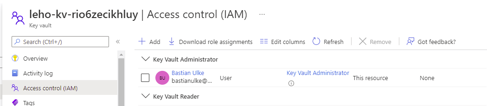

# Accessing Secrets from Azure Key Vault

## Prerequesites
- Make sure you have a deployment of the AKS baseline architecture reference implementation deployed and available.

##  Walthrough Overview
In this walkthrough, you will...
- ...add a new secret to the _Azure Key Vault_,
- ...deploy a new `SecretClassProvider` mapping this secret to a file in a the file system of a pod container,
- ...and deploy another `SecretClassProvider` that maps the secret to an environment variable.

## Procedure

### Add a demo secret

- Access the IAM blade of your Key Vault and (temporarily) add yourself as _Key Vault Admin istrator_.

    

- Access the _Networking_ blade and  (temporarily) add your current IP address as allowed network (Get your IP address from [https://ifconfig.io/](https://ifconfig.io/)):

    

- Open the _Secrets_ blade and create a new secret.

    

- Remove the role assignment and the network access rule.


### Access the secret from a pod

- Open `secretproviderclass_fs.yaml` and replace `<tenant-Id>` and `<key-vault-name>`  with the values of your environment.

- Apply this file to your Kubernetes cluster:

  ```bash
  kubectl apply -f secretproviderclass_fs.yaml
  ```

- Inspect file `azure-cli-pod.yaml` and see how...
    - ...`metadata/labels/aadpodbinding` referes to the existing pod identity created for the ingress controller;
    - ...`spec/containers/volumeMounts` declares a read-only volume to show the certificates...
    - ...that links to the volume specified in `spec/volumes`.

- Deploy this pod.

  ```bash
  kubectl apply -f azure-cli-pod_fs.yaml
  ```

- If you want, observe the container as it is being created using these commands
    ```bash
    watch kubectl get pods -n a0008
    ```

    ```bash
    watch "kubectl describe pod azure-cli-pod -n a0008 | tail -n 10"
    ```

- Log in to the container ...

    ```bash
    kubectl exec -it azure-cli-pod -n a0008 -- bash
    # which will show prompt 'bash-5.1#'.
    ```

    ...list the content of directory `/mnt/secrets-store` and print content of the secret:

    ```bash 
    ls /mnt/secrets-store
    cat /mnt/secrets-store/my-demo-secret
    ```

    The output should look like this:

    ```bash
    bash-5.1# ls /mnt/secrets-store
    my-demo-secret

    bash-5.1# cat /mnt/secrets-store/my-demo-secret
    HalloSecretWorld!
    ```

- Delete pod and secret provider class to clean up.

    ```bash
    kubectl delete -f azure-cli-pod_fs.yaml
    kubectl delete -f secretproviderclass_fs.yaml
    ```

### Access the secret via environment variable

- Many containers require a password to be passed as environment variable, rather than as file content. Let's now see how you can make secrets available as environment variables in a container.

- Open `secretproviderclass_env-var.yaml` and replace `<tenant-Id>` and `<key-vault-name>`  with the values of your environment.

- Inspect files `secretproviderclass_env-var.yaml` and `azure-cli-pod_env-var.yaml` and see...
    - ...how `secretproviderclass_env-var.yaml` declares a `secretObject` named `my-demo-secret-object` mapping the Key Vault secret to the key `my-demo-secret-key`
    - ...how `azure-cli-pod_env-var.yaml` refers to this secret declaration using a `secretKeyRef` to map it to the environment variable `DEMO_SECRET`.

- Deploy secret class provider and pod.

    ```bash
    kubectl apply -f secretproviderclass_env-var.yaml
    kubectl apply -f ./azure-cli-pod_env-var.yaml
    ```

- Now log in to the container again ...

    ```bash
    kubectl exec -it azure-cli-pod -n a0008 -- bash
    ```

  ...and print the value of variable `DEMO_SECRET` (as defined in `azure-cli-pod_env-var.yaml`):

    ```bash
    echo $DEMO_SECRET
    ```

- Delete pod and secret provider class to clean up.

    ```bash
    kubectl delete -f azure-cli-pod_env-var.yaml
    kubectl delete -f secretproviderclass_env-var.yaml
    ```

# Resources

- [Provide an identity to access the Azure Key Vault Provider for Secrets Store CSI Driver](https://docs.microsoft.com/en-us/azure/aks/csi-secrets-store-identity-access)
- [Provide an identity to access the Azure Key Vault Provider for Secrets Store CSI Driver](https://docs.microsoft.com/en-us/azure/aks/csi-secrets-store-identity-access)
- [Azure Key Vault Provider for Secrets Store CSI Driver](https://azure.github.io/secrets-store-csi-driver-provider-azure/docs/)